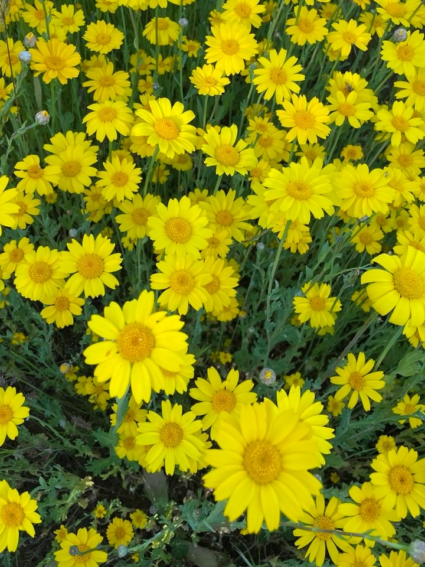
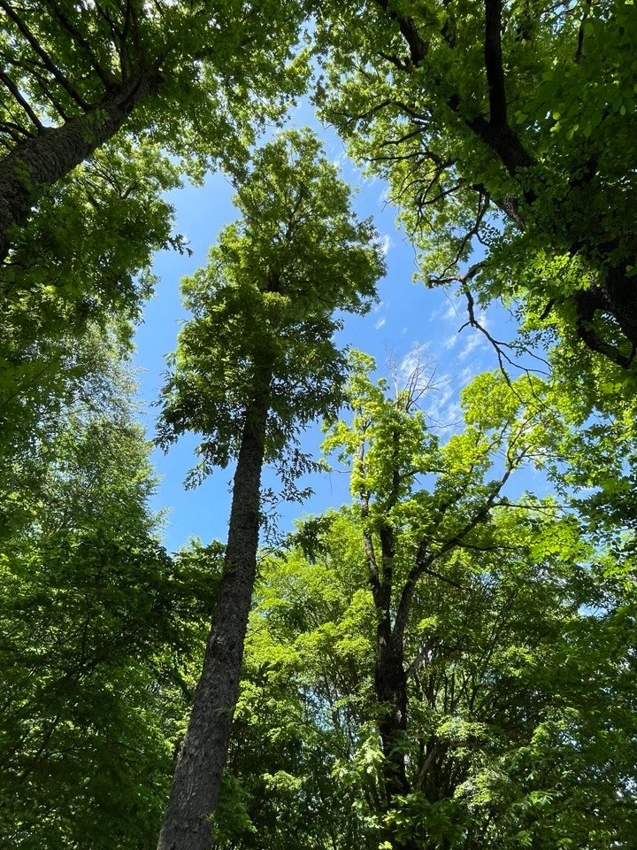
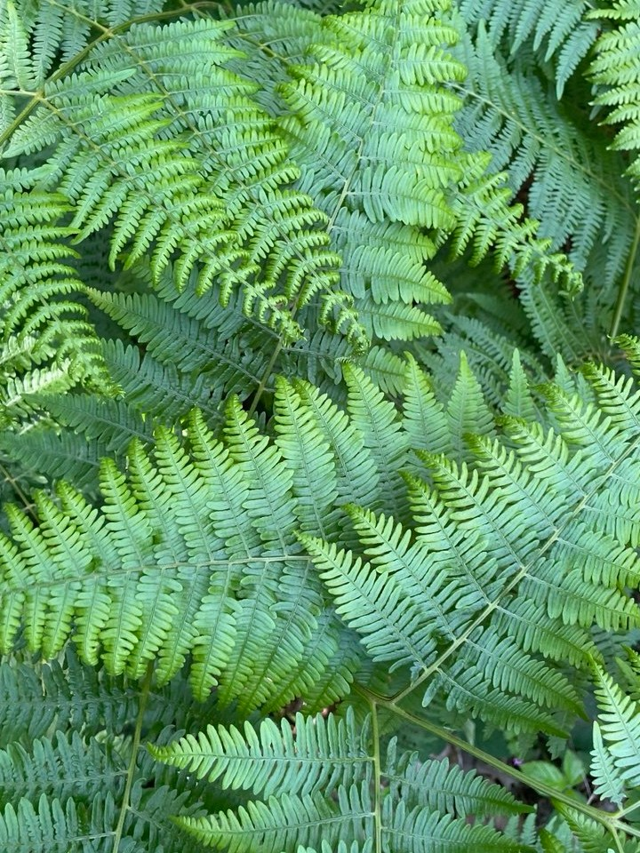
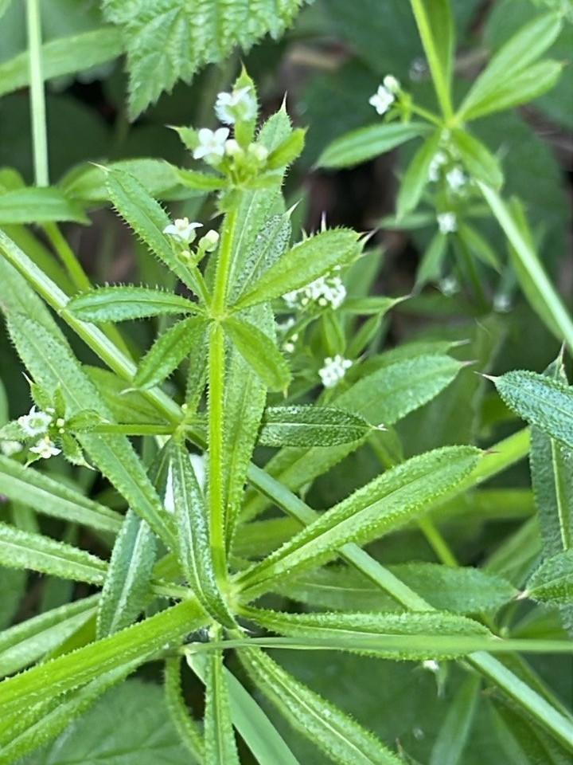
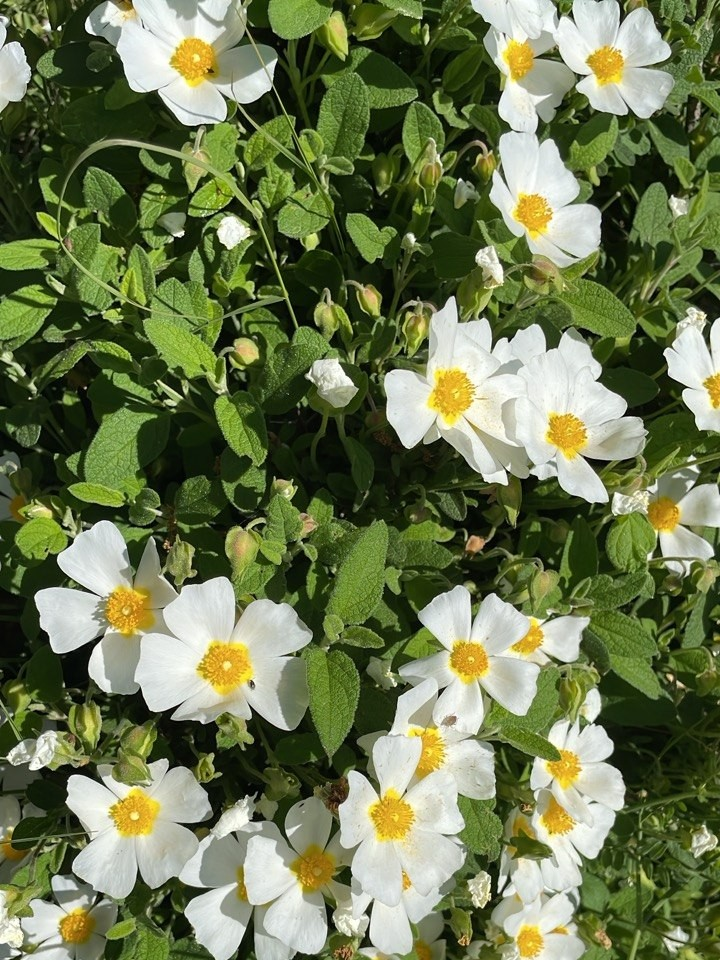
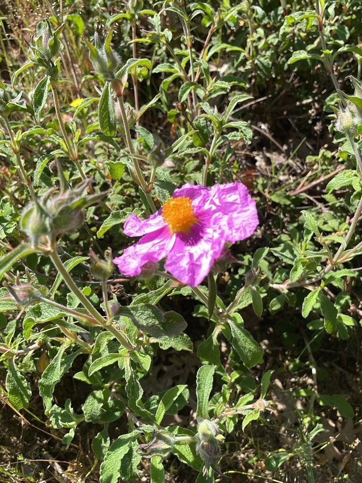

## 

Mayıs'ın ikinci haftası 3 günlük şafak korosu kampı için gittiğim Şaroluk ve Geyikli köyleri arasında, şafağın ilk dakikalarında kayın ve meşe karışık ormanına sınır sarı papatya tarlası.

<!-- SoundCloud iframe kodunu buraya yapıştır -->
<iframe width="100%" height="166" scrolling="no" frameborder="no" allow="autoplay; encrypted-media" src="https://w.soundcloud.com/player/?url=https%3A//api.soundcloud.com/tracks/soundcloud%253Atracks%253A2340286148&color=%23322d30&auto_play=false&hide_related=false&show_comments=true&show_user=true&show_reposts=false&show_teaser=true"></iframe>
<a href="https://soundcloud.com/eniscakar" title="Enis Çakar" target="_blank" style="color: #cccccc; text-decoration: none;">Enis Çakar</a> · <a href="https://soundcloud.com/eniscakar/ari-yatagi-agackakan" title="Arı Yatağında Ağaçkakan ve Yoldaşları, Şaroluk Balıkesir" target="_blank" style="color: #cccccc; text-decoration: none;">Arı Yatağında Ağaçkakan ve Yoldaşları, Şaroluk Balıkesir</a>

## 

Kayın ve meşe ormanı dik yamaçlarda olduğu için kayıt noktamı fotoğraftaki orman ve tarla kesişimine kurmuştum. Daha çadırımı kurarken beni yakın mesafede bir ağaçkakan karşılamıştı ve şafak vakti kaydıma girer umuduyla oldukça heyecanlanmıştım. 

Daha ilk şafakta kendisini duyurdu, tam o esnada güneş yavaş yavaş çıkmaya başlamışken yandaki sarı papatya tarlasında arılar da işbaşına koyuldu. Kayıttaki diğer tüm işittiğiniz kuş türlerini de notlara ekledim. Her ne kadar kayıtta çok duyulmasa da bölgede oldukça fazla sarıasma kuşu ve ibibik işittim. 

## 

| | | |
|---|---|---|
|  |  |  
|  |  |  |

## Habitat ve Tür Bilgisi

- **Habitat:** meşe ve kayın ormanı, çayır
- **Türler:** alaca ağaçkakan, sarıasma, karatavuk, çıvgın, ispinoz, kızılgerdan, guguk, yaban arısı, sarı papatya, pembe laden, adaçayı yapraklı laden, yapışkan otu, kartal eğreltisi, doğu kayını, saçlı meşe
- **Tarih:** 16 Mayıs 2026
- **Koordinat:** 40.154633, 27.473707
- **Konum:** Sarıköy-Balıkesir

