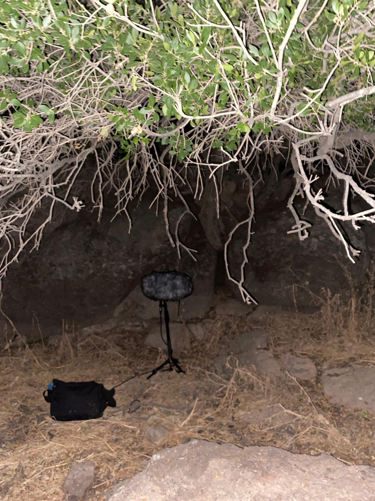
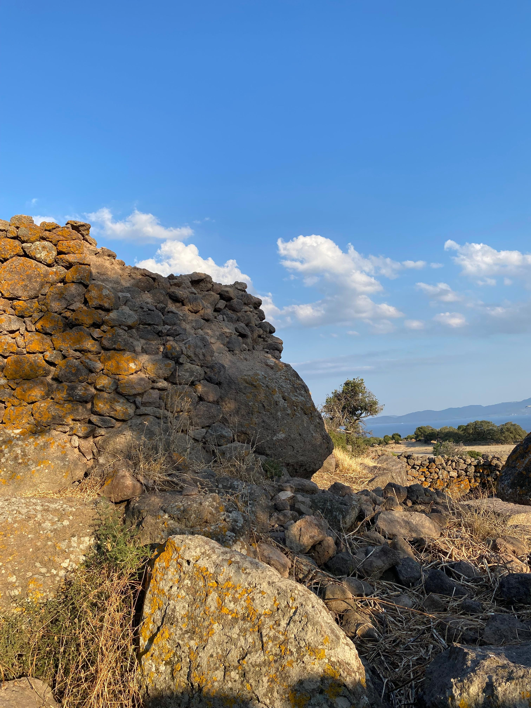
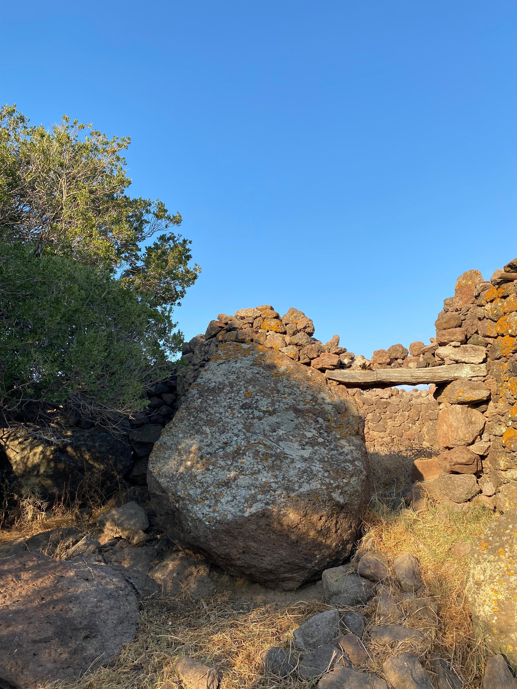

## 

Assos’ta yaz mevsimini yaşamış olmak...
Sararmış otların kokusuyla sarılıp, kaya ve taş tarlalarında yürümek.
Taşların üstünde çeşit çeşit likenler, Anadolu meşeleri, zeytinler,
akçakesmeler ve daha niceleri...

<!-- SoundCloud iframe kodunu buraya yapıştır -->
<iframe width="100%" height="166" scrolling="no" frameborder="no" allow="autoplay; encrypted-media" src="https://w.soundcloud.com/player/?url=https%3A//api.soundcloud.com/tracks/soundcloud%253Atracks%253A2150468922&color=%2330312e&auto_play=false&hide_related=false&show_comments=true&show_user=true&show_reposts=false&show_teaser=true"></iframe>
<a href="https://soundcloud.com/eniscakar" title="Enis Çakar" target="_blank" style="color: #cccccc; text-decoration: none;">Enis Çakar</a> · <a href="https://soundcloud.com/eniscakar/assos_yelinde_akcakesmenin_ini" title="Assos Yelinde Akçakesmenin İni: Taşlar ve Rüzgar" target="_blank" style="color: #cccccc; text-decoration: none;">Assos Yelinde Akçakesmenin İni: Taşlar ve Rüzgar</a>

## 

Tüm bu güzellikleri rüzgarlı bir havada deneyimlerken,
önümüze taşlarla özenerek yapılmış oldukça eski bir ahır denk geliyor.
Merak edip çatısı bile kalmamış ahıra girdiğimizde,
kocaman kayaların arasından fırlamış bir akçakesme ağacına dikkat kesiliyoruz.
Ağaç oldukça yaşlı, her halinden belli. Rüzgarın şiddetiyle kulaklarımız,
gördüğümüze ağır basmaya başlıyor. Kayaların arasından fırlamış ağacın gövdesi
ve kurumuş büyük dallarından çıkan ses, bize ağacın yaşama inadını işitsel
olarak sergiliyor. Her bir dal, her bir yaprak, yaşama tutunmanın birer hatırlatıcısıydı.

## 

| | | |
|---|---|---|
|  |  |  |

## Habitat ve Tür Bilgisi

- **Habitat:** Maki ve kayalık yamaç
- **Türler:** akçakesme, anadolu meşesi, zeytin
- **Tarih:** 31 Temmuz 2025
- **Koordinat:** 39.487312, 26.241065
- **Konum:** Behram-Assos

## Tür Fotoğrafları

