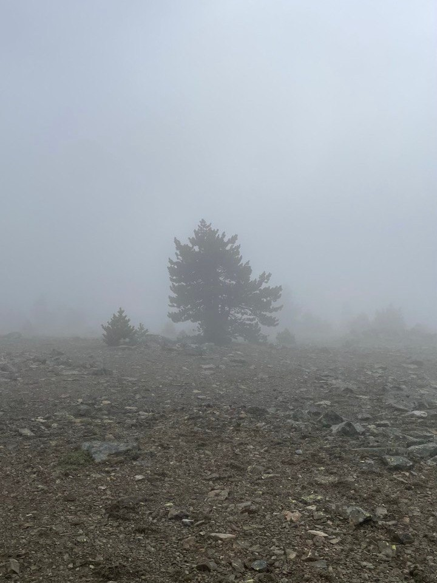
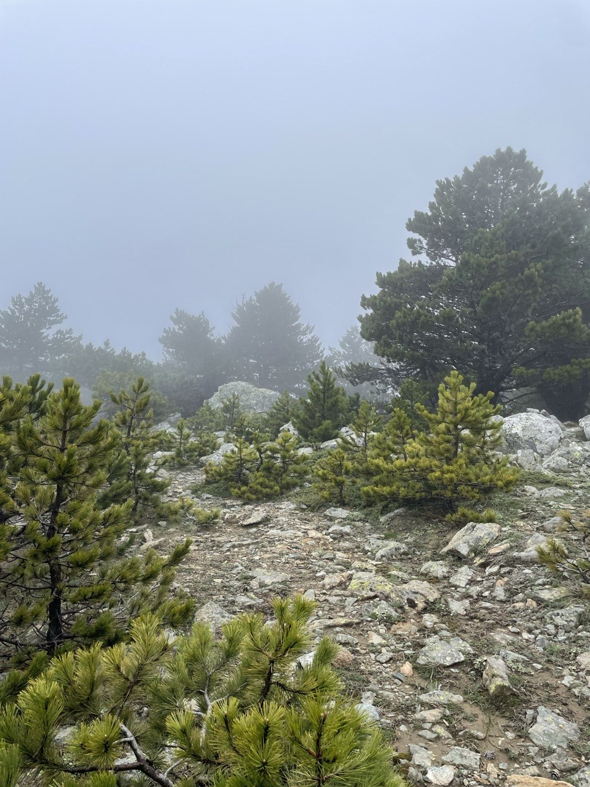
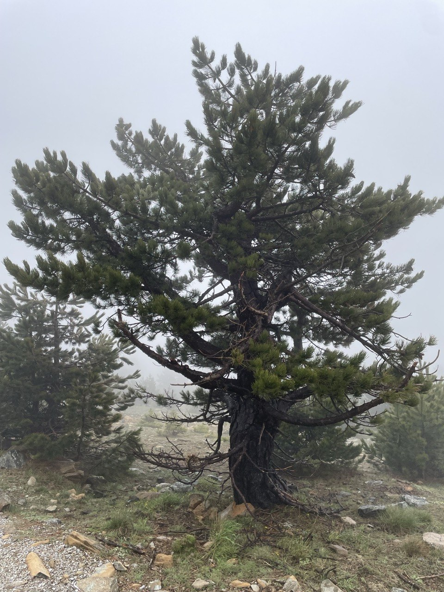

## 

Bulutların beni kucakladığı fırtınalı bir günde, Kazdağları'nın zirvesinde.

<!-- SoundCloud iframe kodunu buraya yapıştır -->
<iframe width="100%" height="166" scrolling="no" frameborder="no" allow="autoplay; encrypted-media" src="https://w.soundcloud.com/player/?url=https%3A//api.soundcloud.com/tracks/soundcloud%253Atracks%253A1836349941&color=%238f836c&auto_play=false&hide_related=false&show_comments=true&show_user=true&show_reposts=false&show_teaser=true"></iframe>
<a href="https://soundcloud.com/eniscakar" title="Enis Çakar" target="_blank" style="color: #cccccc; text-decoration: none;">Enis Çakar</a> · <a href="https://soundcloud.com/eniscakar/mountain-wind-summit-of-kazdaglari-1770m" title="Kazdağları Zirvesinde Fırtına, Sarıkız Zirve" target="_blank" style="color: #cccccc; text-decoration: none;">Kazdağları Zirvesinde Fırtına, Sarıkız Zirve</a>

## 

Her ziyaretimde bana farklı hediyeler sunuyor Kazdağları. Var oluşum üzerine düşünmeme ve olgunlaşmama tanıklık ediyor. 

Ziyaret etmekten asla bıkmayacağım binbir pınarlı Kazdağları...

## 

| | | |
|---|---|---|
|  |  |  |

## Habitat ve Tür Bilgisi

- **Habitat:** Dağ zirvesi, Kayalar
- **Türler:** karaçam, kara kızılkuyruk
- **Tarih:** 25 Mayıs 2024
- **Koordinat:** 39.694297, 26.882589
- **Konum:** Edremit-Balıkesir

