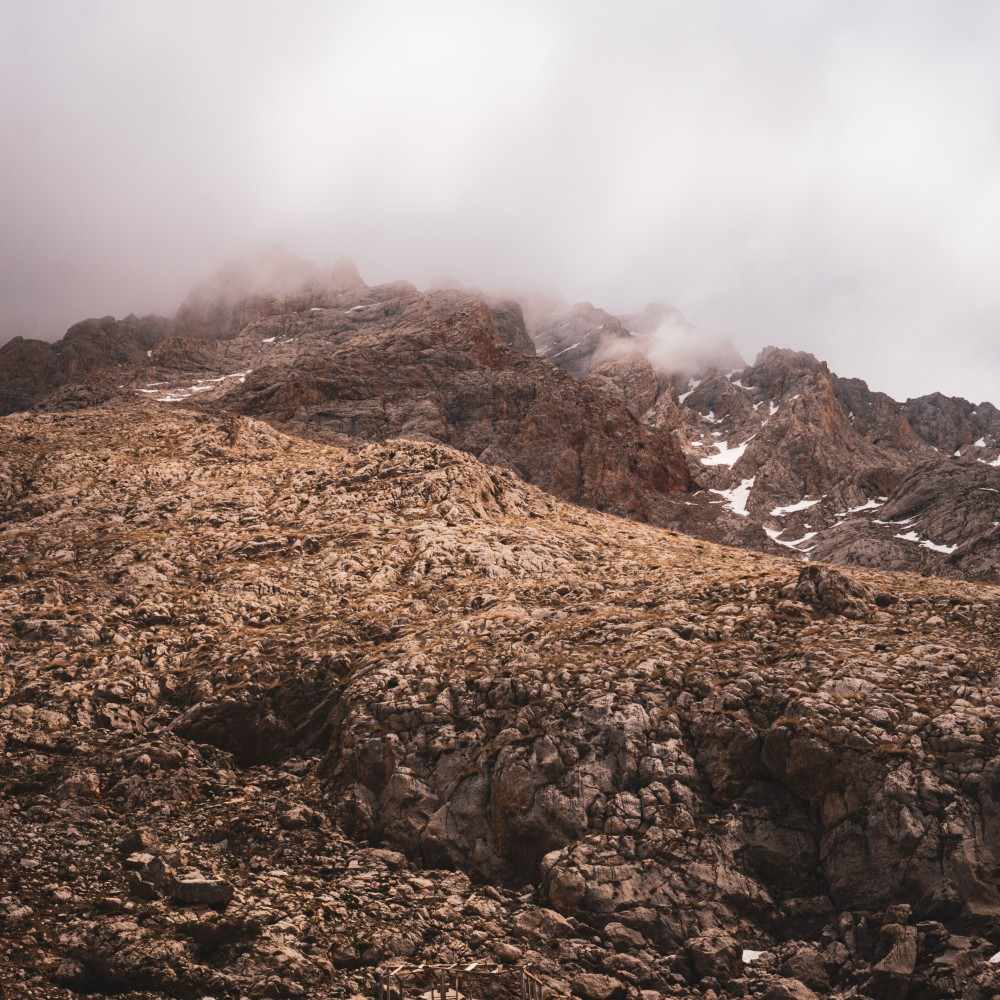
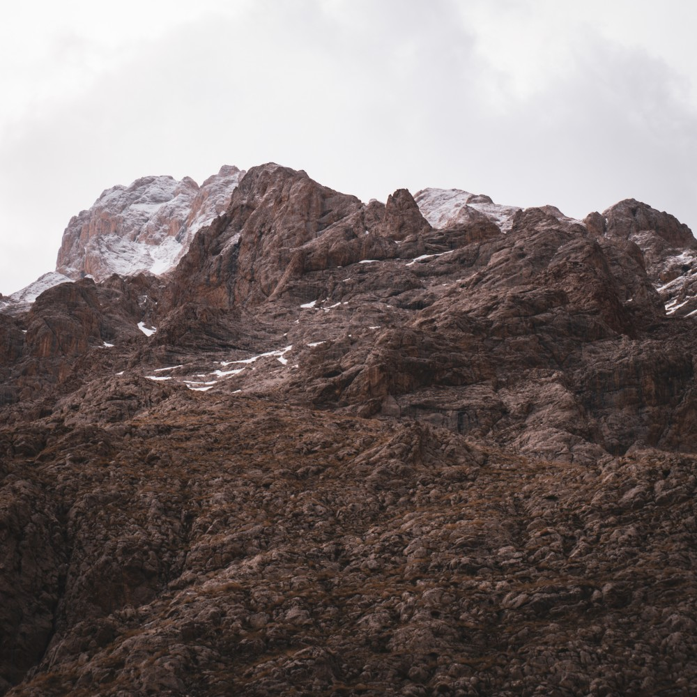
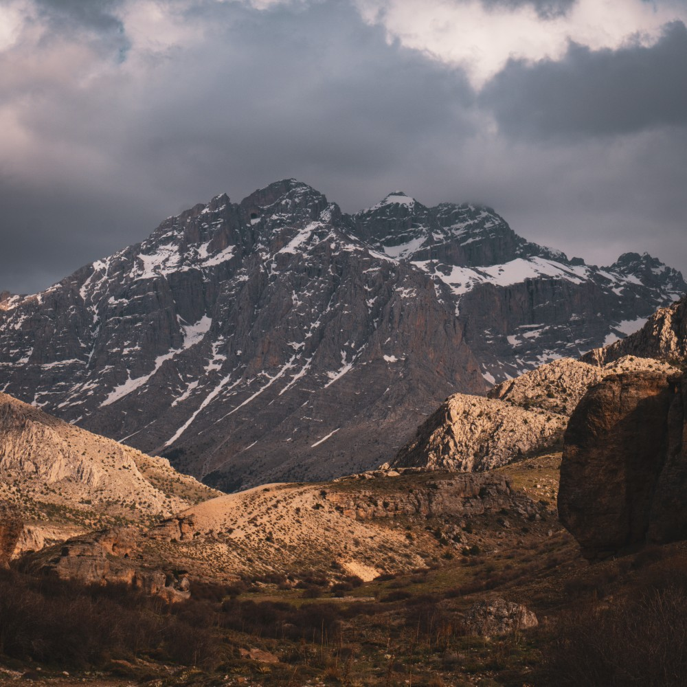

## 

Aladağlar’da Kazıklı Ali Kanyonu'nda tüm canlı ve cansız türleri, nesneleri ses olarak bir arada tutan, oldukça da görünür olan o ağ kayalar.

<!-- SoundCloud iframe kodunu buraya yapıştır -->
<iframe width="100%" height="166" scrolling="no" frameborder="no" allow="autoplay; encrypted-media" src="https://w.soundcloud.com/player/?url=https%3A//api.soundcloud.com/tracks/soundcloud%253Atracks%253A2117195148&color=%23574944&auto_play=false&hide_related=false&show_comments=true&show_user=true&show_reposts=false&show_teaser=true"></iframe>
<a href="https://soundcloud.com/eniscakar" title="Enis Çakar" target="_blank" style="color: #cccccc; text-decoration: none;">Enis Çakar</a> · <a href="https://soundcloud.com/eniscakar/dawn-chorus-in-kazikli-ali-canyon" title="Taşlar ve Kuşlar - Kazıklı Ali Kanyonu’nda Şafak Korosu / Dawn Chorus in Kazıklı Ali Canyon" target="_blank" style="color: #cccccc; text-decoration: none;">Taşlar ve Kuşlar - Kazıklı Ali Kanyonu’nda Şafak Korosu / Dawn Chorus in Kazıklı Ali Canyon</a>

## 

Kayaların diğer türlerle olan yoldaşlığı havada süzülen ve avını arayan kerkenez ile aynı. Bu kayalar sesin yüklenicisi ve taşıyıcısı görevini tıpkı bir derenin suyu taşıması gibi çok zengin bir şekilde gerçekleştiriyor. Sesi, kanyonun bir ucundan alıp diğer ucuna taşıyor.

Aladağlar’da yaşayan canlıların ses ile olan bağı başka bir habitata göre ne kadar farklı?

Kanyonun 800 metre ötesinde öten bir puhu(kartal baykuşu), avına bu tehlikeyi erken bildirmiş olması lazım. Bu ihtimaller üzerinde çok daha fazla durmadan; kayaların tüm yoldaşları ile birlikte şekillendirdiği, kendi habitatını yarattığı aşikar.

## 

| | | |
|---|---|---|
|  |  |  |

## Habitat ve Tür Bilgisi

- **Habitat:** Yüksek dağ çayırları, sarp kayalıklar
- **Türler:** Ardıç, karaçam, geven ve dahası
- **Tarih:** 28 Nisan 2025
- **Koordinat:** 37.784634, 35.058182
- **Konum:** Çamardı-Niğde

## Tür Fotoğrafları

