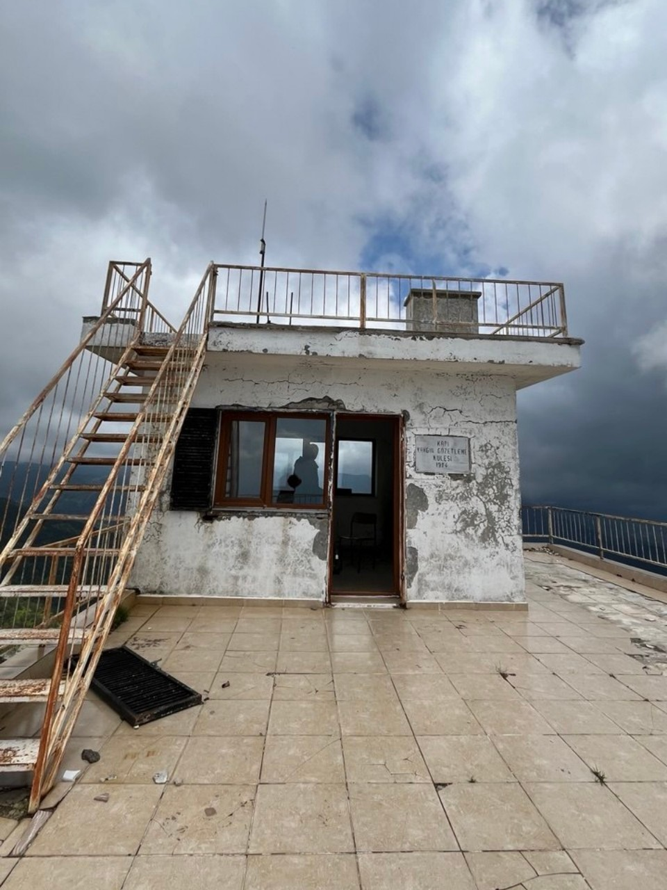
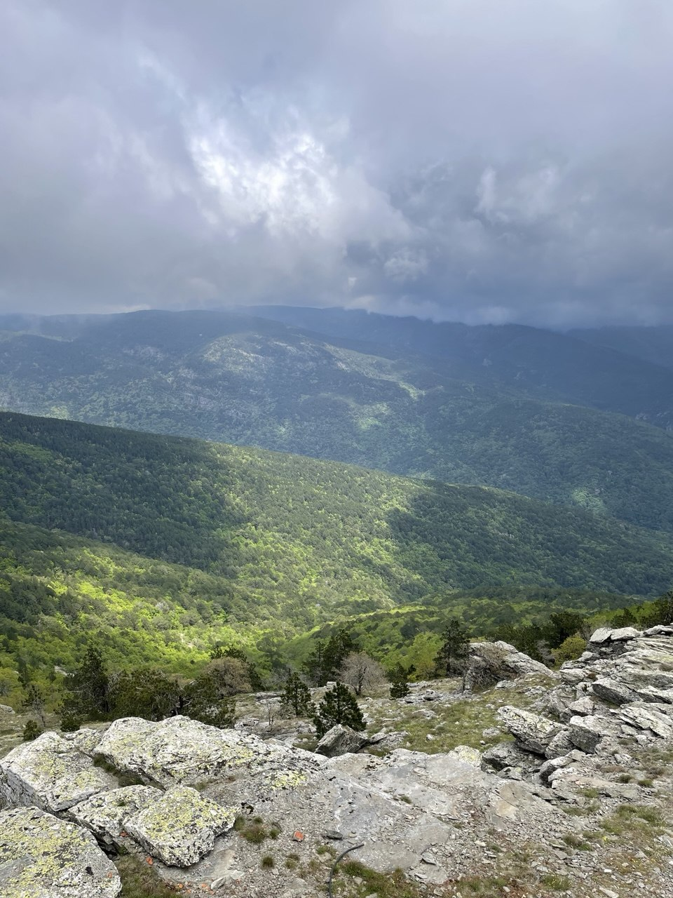
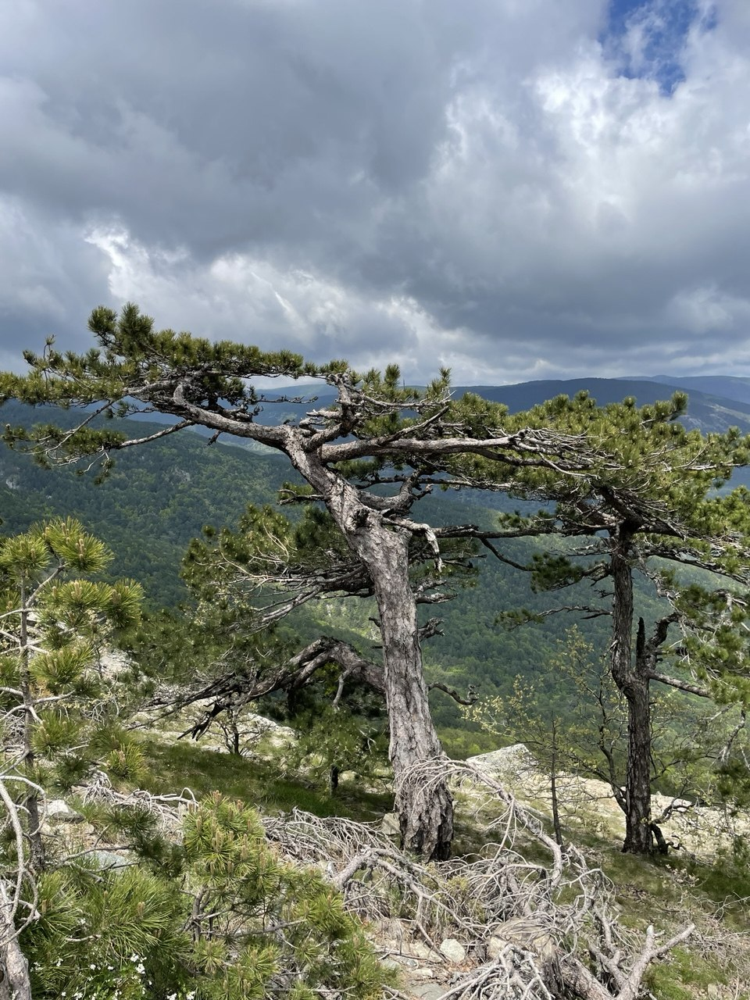
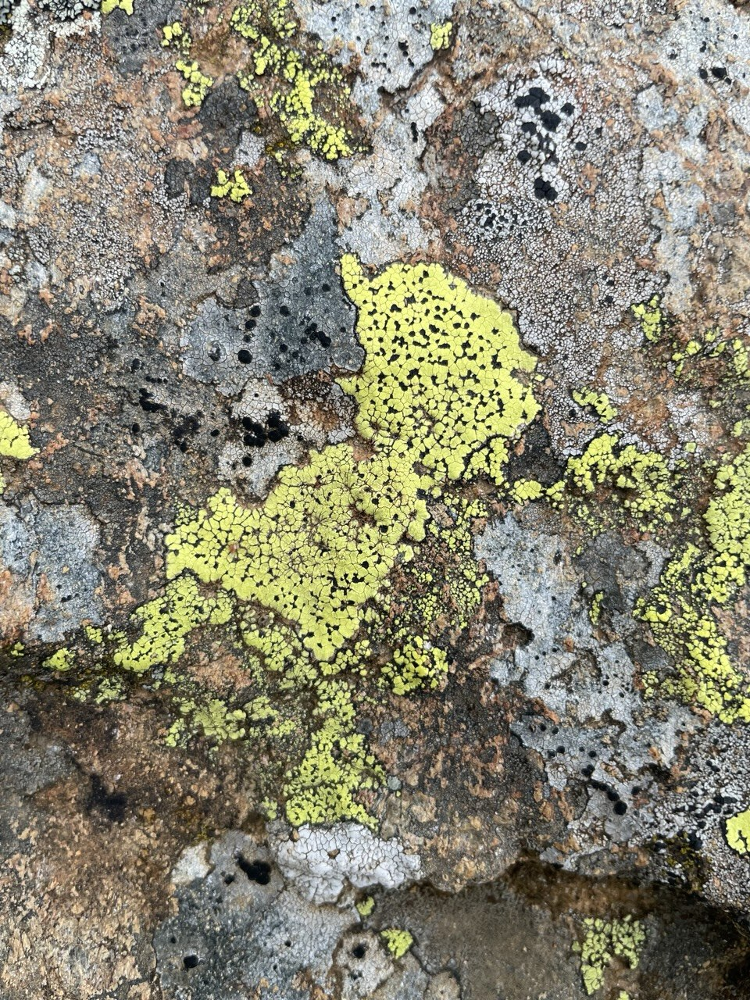
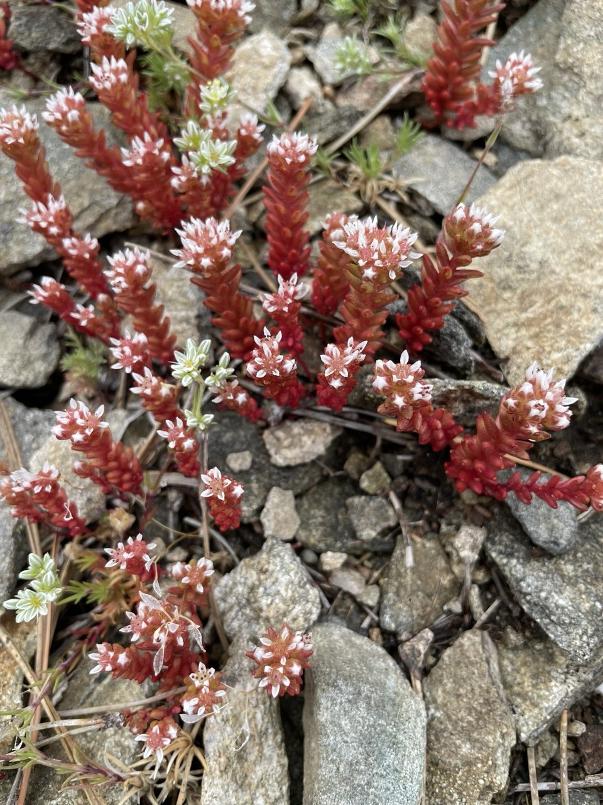
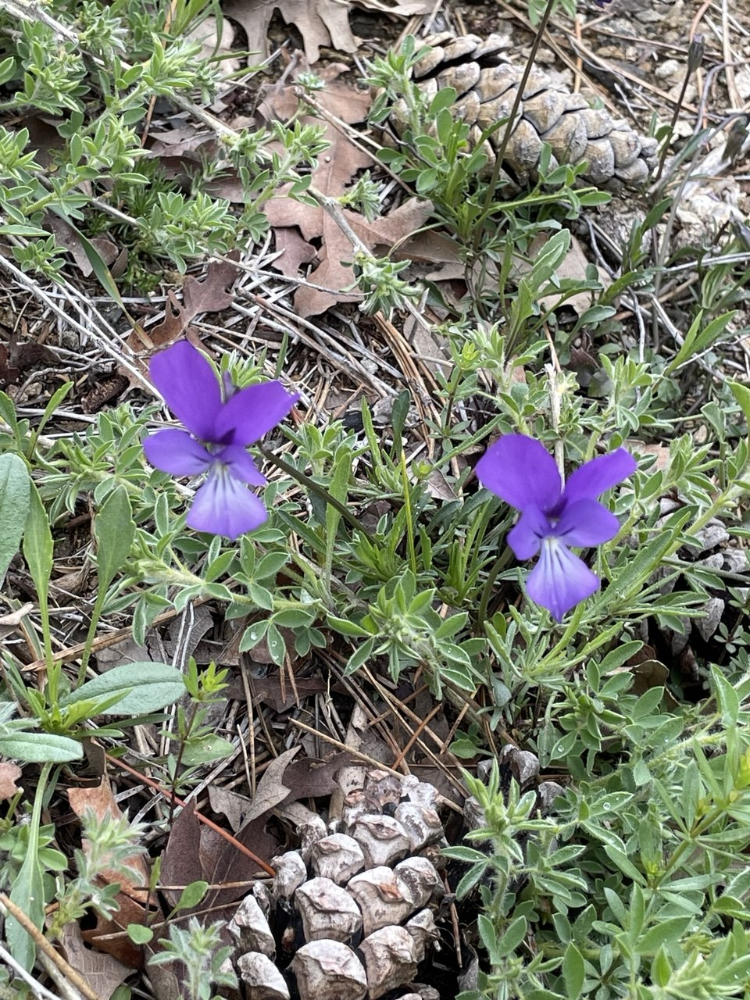

## 

1984 yılında yapılmış Kapı Yangın Gözetleme Kulesi'nin içinde kaydettiğim fırtına. Gözetleme kulesi günümüzde artık kullanılmıyor. Genelde zirve yürüyüşünde durak noktası olarak kullanılıyor. Bir tarafı körfeze, diğer tarafı ise Kazdağları'nın derin vadilerine ve yüksek noktalarına bakıyor.

<!-- SoundCloud iframe kodunu buraya yapıştır -->
<iframe width="100%" height="166" scrolling="no" frameborder="no" allow="autoplay; encrypted-media" src="https://w.soundcloud.com/player/?url=https%3A//api.soundcloud.com/tracks/soundcloud%253Atracks%253A2340294899&color=%23322d30&auto_play=false&hide_related=false&show_comments=true&show_user=true&show_reposts=false&show_teaser=true"></iframe>
<a href="https://soundcloud.com/eniscakar" title="Enis Çakar" target="_blank" style="color: #cccccc; text-decoration: none;">Enis Çakar</a> · <a href="https://soundcloud.com/eniscakar/kazdaglari-yangin-gozlem" title="Terkedilmiş Yangın Gözetleme Kulesinde Fırtına, Kazdağları" target="_blank" style="color: #cccccc; text-decoration: none;">Terkedilmiş Yangın Gözetleme Kulesinde Fırtına, Kazdağları</a>

## 

| | | |
|---|---|---|
|  |  |  
|  |  |  |

## Habitat ve Tür Bilgisi

- **Habitat:** Dağ ormanları, Kayalıklar
- **Türler:** karaçam, menekşe, dağ sümbülü, dam koruğu, harita likeni
- **Tarih:** 24 Mayıs 2026
- **Koordinat:** 39.681161, 26.91574
- **Konum:** Edremit Balıkesir

